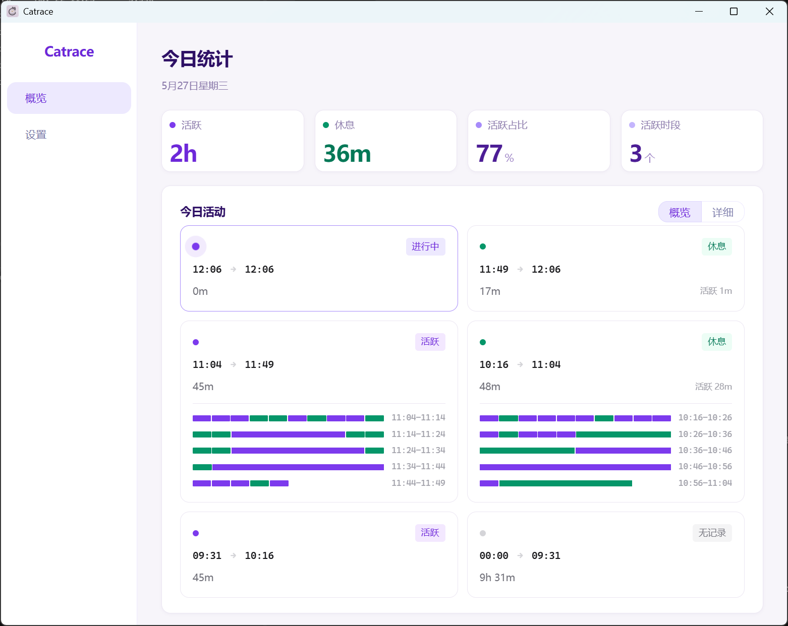

# Catrace

[English](README_EN.md) | 中文

🏠 官网主页：https://lanxiuyun.github.io/Catrace

一个帮你平衡工作与休息的小工具。

参与开发请参阅 [贡献指南](CONTRIBUTING.md)。

## [下载最新版本](https://download.upgrade.toolsetlink.com/download?appKey=RBrITa0T5PKRzdYuwwxzow)

## 它是干嘛的

很多人一坐电脑前就是几个小时，等反应过来已经腰酸背痛了。
Catrace 就是来解决这个问题的——它在后台默默观察你的活动状态，发现你连续工作太久，就会提醒你站起来休息一会儿。

## 它是怎么知道你在忙的

它不会偷拍屏幕，也不读取你在做什么。它只是悄悄看看你的鼠标有没有动、键盘有没有敲。

然后根据一套简单的规则来判断：

- 它也会识别你正在进行屏幕消费的状态（如看视频、听音乐、看直播），即使那段时间键鼠活动不多。Windows 下通过检测系统音频输出并匹配音频输出进程排除列表来判断；macOS / Linux 下此功能暂时未实现。
- 从你今天第一次敲键盘或动鼠标开始，它开始计时。
- 中间去倒杯水、回个消息、发个呆，只要没连续歇够一段时间，它都觉得你还在同一个工作节奏里。
- 只有当你真的停下来、连续好几分钟一动不动，它才认为你在休息，并把这段时间记下来。
- 如果你一口气忙满了一个「工作窗口」（比如 45 分钟），中间一直没歇够，或者休息完又忙满了一个窗口，它就会弹出一条通知，温柔地提醒你：该休息啦。

## 提醒方式

到时间后，Catrace 会通过你选择的方式提醒你休息。支持三种提醒模式：

- **通知提醒** — 屏幕右下角弹出浮动通知卡片，支持多条堆叠显示；每张卡片带「5 分钟后提醒」「10 分钟后提醒」「跳过本次」三个按钮，鼠标悬停暂停倒计时
- **弹窗提醒** — 应用内弹窗提醒，倒计时结束后自动关闭
- **全屏提醒** — 全屏覆盖提醒，可自定义背景图片和遮罩透明度，让你不得不停下来休息

你可以设置自己的工作时长和休息判定时长，找到最适合自己的节奏。

## 喝水提醒

除了提醒你站起来休息，Catrace 也可以按你设定的间隔提醒你喝水，防止一忙起来就忘记补水。

- 只在 Detect 到你正在活跃时检查，休息时不会打扰。
- 到点后右下角弹出蓝色喝水 Toast，与 Dashboard 喝水小组件主题统一，点击「已喝水」即可记录一次。
- 在 Dashboard 的喝水小组件里，可以手动加减今日喝水次数，并查看今天的喝水时间轴。

> 只要你开始休息（哪怕只休息了一分钟），提醒就会自动停止，不会在你休息时一直提醒。等你恢复工作了，它才会重新判断。

## 友链

