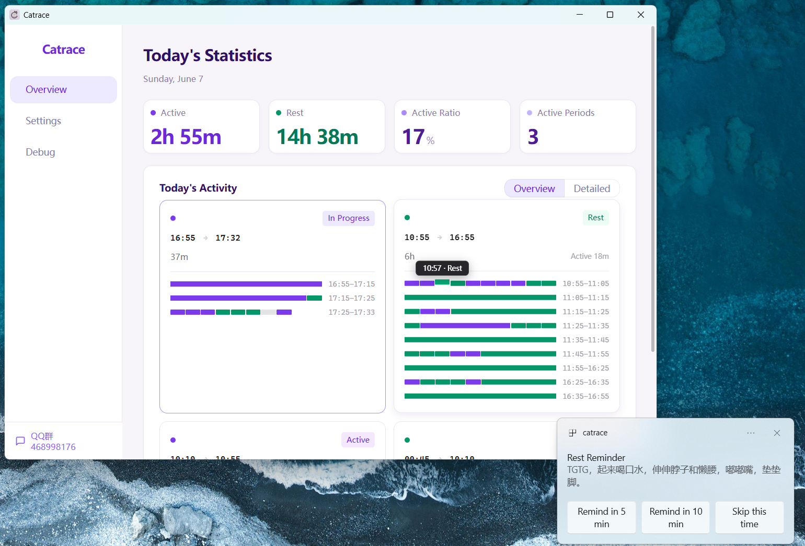

# Catrace

[中文](README.md) | English

🏠 Homepage: https://lanxiuyunO.github.io/Catrace

A small tool that helps you balance work and rest.

See [Contributing Guide](CONTRIBUTING.md) to get involved.

## Download

[→ Download latest release](https://download.upgrade.toolsetlink.com/download?appKey=61JFztFHDmB_pGMdySezXg)

## What it does

Many people sit in front of the computer for hours, and by the time they realize it, their back and neck are already sore.
Catrace is here to solve this problem — it quietly watches your activity in the background, and when it detects you've been working continuously for too long, it reminds you to stand up and take a break.

## How it knows you're busy

It doesn't take screenshots of your screen, nor does it read what you're doing. It simply checks whether your mouse has moved or your keyboard has been tapped.

Then it follows a simple set of rules:

- It also detects when you're consuming screen content (watching videos, listening to music, or viewing live streams), so even periods with little keyboard/mouse activity can still count as active. On Windows, this is determined by system audio output matched against an exclusion list for the audio-output process; this feature is not yet available on macOS / Linux.
- It starts counting from the first time you type or move the mouse today.
- If you get up for water, reply to a message, or zone out — as long as you don't stop for a continuous stretch, it still considers you in the same work rhythm.
- Only when you truly pause and stay still for several minutes does it mark that time as rest.
- If you power through a full "work window" (say, 45 minutes) without enough rest in between, or you rest and then fill another full window, it pops up a gentle reminder: time to take a break.

## How it reminds you

When it's time, Catrace reminds you to take a break using your chosen method. Three reminder modes are available:

- **Notification Reminder** — Floating notification cards stack in the bottom-right corner; each card has three buttons: "Remind in 5 min", "Remind in 10 min", and "Skip this time". Hovering a card pauses its countdown timer. When you start resting, an additional green liquid-ball timer appears: the liquid level rises with your rest progress and has a flowing wave animation, showing how long you've rested and whether you've reached the valid rest threshold. On Windows, the notification window does not steal the current input focus, so renaming files or typing in another app is not interrupted
- **Popup** — An in-app popup with a countdown timer that auto-closes when done. On Windows, it also avoids stealing focus from the foreground window
- **Fullscreen** — A full-screen overlay that forces you to stop and rest, with customizable background image and overlay opacity

You can customize your work window length and rest threshold to find the rhythm that suits you best.

## Water Reminder

In addition to reminding you to stand up and rest, Catrace can also remind you to drink water at your chosen interval, so you don't forget to stay hydrated while busy.

- Checks only when you are currently active; it won't bother you while resting.
- Pops a blue water reminder Toast in the bottom-right corner, matching the Dashboard water widget theme; click "Drank" to log a glass.
- Use the water widget on the Dashboard to manually add or remove today's drink count and view your drinking timeline.

> As soon as you start resting (even just one minute), reminders stop automatically. They won't keep buzzing while you're on a break. They only resume after you get back to work.

## Privacy

All data stays on your own computer. Nothing is uploaded to any server. It doesn't record which keys you pressed or where you clicked — only whether "this minute you were active" or "this minute you were resting."

## Dashboard Overview

Catrace offers a clean Dashboard to help you review your work and rest rhythm for the day:

- **Today's Stats**: total active time, total rest time, active ratio, and number of work blocks
- **Today's Activity (Overview)**: Time-block cards based on your work rhythm, showing at a glance how work and rest alternated today; click a card to expand and see details in 10-minute slices
- **Today's Activity (Detailed)**: A 24-hour minute-level heatmap, useful when you want to check a specific moment precisely
- **Settings**: Adjust work window length and rest threshold, choose reminder mode (Notification Reminder / Popup / Fullscreen), customize reminder content and fullscreen background, enable media-active detection with exclusion whitelist (Windows), enable auto-start on boot, and switch interface language (Simplified Chinese / English)

The interface uses a soft purple wellness theme with a sidebar navigation and main content area — clean and refreshing. Supports bilingual switching between Simplified Chinese and English, defaulting to your system language.
