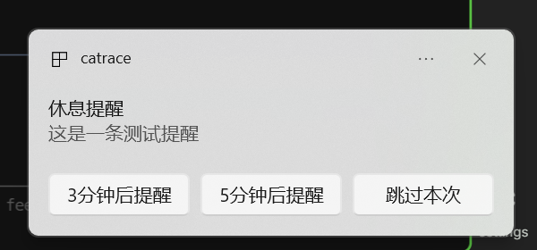

# Catrace

A small tool that helps you balance work and rest.

[→ Download latest release](https://github.com/lanxiuyun/catrace/releases)

## What it does

Many people sit in front of the computer for hours, and by the time they realize it, their back and neck are already sore.
Catrace is here to solve this problem — it quietly watches your activity in the background, and when it detects you've been working continuously for too long, it reminds you to stand up and take a break.

## How it knows you're busy

It doesn't take screenshots of your screen, nor does it read what you're doing. It simply checks whether your mouse has moved or your keyboard has been tapped.

Then it follows a simple set of rules:

- It starts counting from the first time you type or move the mouse today.
- If you get up for water, reply to a message, or zone out — as long as you don't stop for a continuous stretch, it still considers you in the same work rhythm.
- Only when you truly pause and stay still for several minutes does it mark that time as rest.
- If you power through a full "work window" (say, 45 minutes) without enough rest in between, or you rest and then fill another full window, it pops up a gentle reminder: time to take a break.

## How it reminds you

When it's time, a system notification appears on your screen, labeled **Catrace**.

The notification has three buttons:

- **Remind in 3 min** — Finish what you're doing, get a nudge in 3 minutes
- **Remind in 5 min** — Snooze for 5 minutes
- **Skip this time** — Keep working, no more reminders until the next work window ends

You can customize your work window length and rest threshold to find the rhythm that suits you best.

> As soon as you start resting (even just one minute), reminders stop automatically. They won't keep buzzing while you're on a break. They only resume after you get back to work.

## Privacy

All data stays on your own computer. Nothing is uploaded to any server. It doesn't record which keys you pressed or where you clicked — only whether "this minute you were active" or "this minute you were resting."

## Dashboard Overview

Catrace offers a clean Dashboard to help you review your work and rest rhythm for the day:

- **Today's Stats**: total active time, total rest time, active ratio, and number of work blocks
- **Today's Activity (Overview)**: Time-block cards based on your work rhythm, showing at a glance how work and rest alternated today; click a card to expand and see details in 10-minute slices
- **Today's Activity (Detailed)**: A 24-hour minute-level heatmap, useful when you want to check a specific moment precisely
- **Settings**: Adjust work window length, rest threshold, and optional auto-start on boot

The interface uses a soft purple wellness theme with a sidebar navigation and main content area — clean and refreshing.
